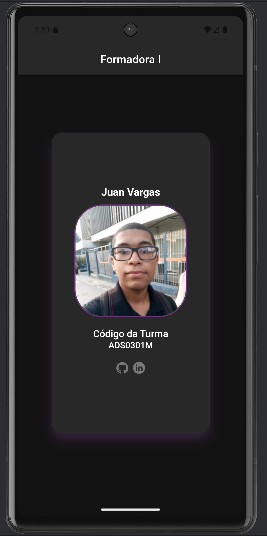

# Avaliação Formadora I

Esta é uma atividade avaliativa da faculdade com o objetivo de reforçar e instigar as noções básicas do uso do Ionic em conjunto com o Android Studio.

## Organização

Para facilitar o acesso, separei os seguintes recursos:

- [Instalador APK](https://github.com/JuanVargas2004/third_semester_exam1/blob/main/app-debug.apk)
- [Código Fonte](https://github.com/JuanVargas2004/third_semester_exam1/tree/main/codigo)

## Descrição da Aplicação

A aplicação é composta por uma única tela, que exibe um card contendo as seguintes informações pessoais:

- **Nome**
- **Foto**
- **Código da turma**
- **Redes Socias**

Este projeto serve como um exercício para aplicação de conceitos básicos do Ionic e Android Studio.

## Imagem da Aplicação

